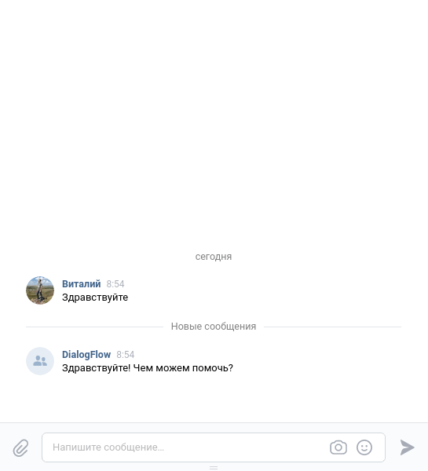

## Description

This is telegram and vk bots. They answer for users on usual questions. Also
you can learning your chat bot to answer for usual question.

Example work:



## Project setup

It is necessary to register ENVIRONMENT variables.
The variable template and their description are in the file

## Installation

Install libraries ```pip install -r requirements.txt```

This command will immediately install:
1. python-dotenv 
2. pytelegrambotapi 
3. vk_api

Create project in [Google Cloud](https://cloud.google.com/dialogflow/es/docs/quick/setup)

Create project in [DialogFlow](https://dialogflow.cloud.google.com/#/getStarted)

#### ENVIRONMENT variables used in the project:
1. VK_TOKEN - token vk group [Create Group or Manage](https://vk.com/groups?tab=admin)
2. TELEGRAM_TOKEN - token for use telegram [@BotFather](https://t.me/BotFather)
3. TOKEN_TELEGRAM_LOGGER - token for send log in telegram [@BotFather](https://t.me/BotFather)
4. CHAT_ID - your chat id in telegram where you will be get log message. [Get Chat ID](https://t.me/userinfobot)
5. PROJECT_ID - your project_id in google cloud [create project](https://cloud.google.com/dialogflow/es/docs/quick/setup)
6. GOOGLE_APPLICATION_CREDENTIALS - json file for google cloud [Create json key](https://cloud.google.com/docs/authentication/getting-started)

## Start Bot

if you want to run telegram bot ```python main.py```
if you want to run vk bot ```python vk_bot.py```

## Learning Bot
You need to create questions.json. 
Template for questions.json:
```json
{
  "YOUR intent name": {
    "questions": [
      "YOUR question 1",
      "YOUR question 2",
      "YOUR question 3",
      "YOUR question 4"
    ],
    "answer": "YOUR answer"
  },
  "YOUR intent name 2": {
    "questions": [
      "YOUR question 1",
      "YOUR question 2",
      "YOUR question 3",
      "YOUR question 4"
    ],
    "answer": "YOUR answer"
  }
}
```
Start to learn bot ```python work_dialog_flow.py```